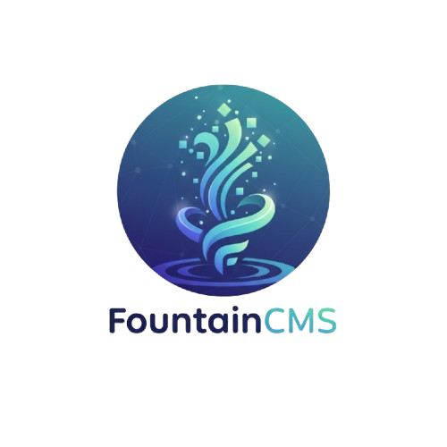

#  FountainCMS Monorepo

**FountainCMS** is a **headless, data-first Content Management System** designed to manage structured content, datasets, and metadata in a clean, scalable, and developer-friendly way.

This repository is organized as a **monorepo** containing both the **frontend (React)** and **backend (NestJS)** codebases that together power the FountainCMS ecosystem.

---

## 🚀 What is FountainCMS?

FountainCMS focuses on **explicit content modeling and API-first delivery**.

Instead of tightly coupling content with presentation, it treats content as **structured data**, allowing teams to:
- Define clear schemas for content and datasets
- Validate and manage data centrally
- Serve content securely through APIs
- Power multiple frontends from a single backend

It is built for teams that care about **data quality, strong contracts, and long-term maintainability**.

---

## 🎯 Why FountainCMS?

Most CMS platforms are either:
- Too rigid for real-world, evolving data models  
- Too abstract, hiding important data decisions behind UI layers  

FountainCMS solves this by:
- Making schemas **explicit and versionable**
- Encouraging **clean separation of concerns**
- Prioritizing **developer control and predictability**

This makes it especially useful for **data-heavy products, dashboards, internal tools, and modern web applications**.

---

## 👥 Who is this for?

- Developers who want full control over content modeling
- Backend-first or API-driven teams
- Startups looking for a flexible, open CMS
- Teams managing datasets, metadata, or configuration-heavy content

---

## 📁 Repository Structure


```
fountaincms/
├── frontend/      # React + Vite frontend app
│   ├── src/
│   ├── public/
│   ├── vite.config.ts
│   ├── index.html
│   ├── package.json
│   └── tsconfig.json
├── backend/       # NestJS backend (TypeScript)
│   ├── src/
│   │   ├── content/
│   │   ├── roles/
│   │   ├── user/
│   │   └── ...
│   ├── test/
│   ├── package.json
│   ├── tsconfig.json
│   ├── jest.config.js
│   └── README.md
├── package.json   # Monorepo root (workspaces)
├── .gitmessage    # Conventional Commits template
├── .husky/        # Git hooks (commit-msg, pre-commit)
├── lint-staged.config.js
├── commitlint.config.js
├── SECURITY.md
├── CONTRIBUTING.md
├── .github/       # Issue/PR templates, workflows
├── .nvmrc         # Node.js version for development (v22.13.1)
└── README.md

````

---

## 🏁 Getting Started

### Prerequisites

- Node.js (**v22.13.1** required, see `.nvmrc`)
- npm (v7+ recommended for workspaces)

### Install dependencies

At the root of the repository:

```sh
npm install
````

This installs dependencies for both frontend and backend using npm workspaces.

---

## ▶️ Running the Project

### Run frontend + backend together

```sh
npm run dev
```

Starts both services in parallel using `concurrently`.

### Run Frontend only

```sh
npm run dev:frontend
```

### Run Backend only

```sh
npm run dev:backend
```

---

## 📚 API Documentation (Swagger)

Once the backend is running:

```
http://localhost:4000/api-docs
```

---

## 🧪 Linting, Formatting, and Testing

* Linting and formatting are enforced via **Husky** and **lint-staged**
* Run all tests:

  ```sh
  npm test
  ```
* Pre-commit hooks will block commits if checks fail

---

## 📝 Git Commit Message Template

This project follows **Conventional Commits**.

### Enable commit template locally

```sh
git config --local commit.template .gitmessage
```

---

## 📦 Release Management & Changelog

* Follows [Keep a Changelog](https://keepachangelog.com/en/1.0.0/)
* Uses [Semantic Versioning](https://semver.org/spec/v2.0.0.html)

### Tagging a Release

1. Update `CHANGELOG.md`
2. Commit:

   ```sh
   git commit -m "chore(release): update changelog for vX.Y.Z"
   ```
3. Tag and push:

   ```sh
   git tag vX.Y.Z
   git push origin vX.Y.Z --follow-tags
   ```

---

## 🤝 Contributing & Security

* See [CONTRIBUTING.md](./CONTRIBUTING.md)
* See [SECURITY.md](./SECURITY.md)

---

## 🌱 Community & Announcements

### 🚀 Migration Complete

The backend has been migrated from **Express to NestJS** for:

* Better scalability and modularity
* Improved type safety
* Cleaner architecture

---

### 🤝 Get Involved

We welcome contributors of all experience levels:

* Build features and integrations
* Fix bugs
* Improve docs and DX
* Review and test code

👉 Check:

* [Issues](https://github.com/building-for-fun/fountainCms/issues)
* [Discussions](https://github.com/building-for-fun/fountainCms/discussions)

---

## ❤️ Our Contributors

<p align="center">
  <a href="https://github.com/building-for-fun/fountainCMS/contributors">
    
  </a>
</p>

---

